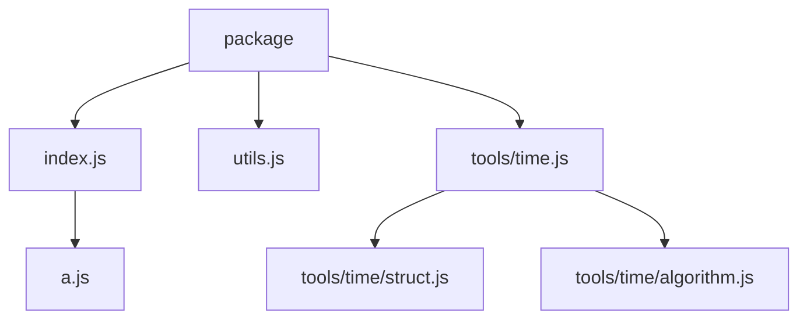

# ECMAScript Package Specification

English | [简体中文](esp.zh.md)

## Introduction

This document defines a package organization specification for ECMAScript.

This specification provides a set of intuitive conventions, aimed at improving the consistency and maintainability of package structure, and making it easier to write automation tools.

## Background

This specification is defined on top of the [ECMAScript Module Specification](https://tc39.es/ecma262/#sec-modules), the [Node.js Package Specification](https://nodejs.org/api/packages.html), and the [JSDoc Specification](https://jsdoc.app/).

However, this specification only guarantees compatibility with the ECMAScript Module Specification and the Node.js Package Specification.
If it conflicts with descriptions in the JSDoc Specification, this specification takes precedence.

## Concepts

### Package structure

A Package consists of one or more Modules.

A typical Package directory structure is as follows:

```
package/
├── src/
│   ├── index.js
│   ├── utils/
│   │   ├── math.js
│   │   └── pool.js
│   ├── utils.js
│   └── config.js
└── package.json
```

### Root directory

A Package needs to define a Root Directory, which defaults to the `src` directory.

### Index modules

There are two ways to define an index module:

- Same-level same-name module: a module that serves as the Index Module of a same-named subdirectory at the same level.
- `index` module: a module named `index` is called the Index Module of the directory that contains it.

Rules:

- The same directory must not have more than one index module at the same time.

Except for using an `index` module in the root directory, it is recommended to define index modules with same-level same-name modules.

For example:

- `src/index.js` is the index module of the `src` directory.
- `src/utils.js` is the index module of the `src/utils/` directory.

### Terminology

- Parent module / child module: the module that contains an `export` statement and the module exported by that statement form a parent-child module relationship.
- Parent symbol / child symbol: a containment relationship between symbols. The parent symbol is a container (such as a class or object), and the child symbols are its members (such as methods or properties).

## Package accessibility

Use tags in documentation comments to declare the package accessibility of a module/symbol.

There are three package accessibility tags:

- `@public` - Public; accessible from any package.
- `@internal` - Private; not accessible from other packages; accessible only within its own package.
- `@unspecified` - Unspecified; cannot be accessed directly, but can be accessed through a public parent module.

Tag rules:

- When no package accessibility tag is present, a module is treated as `@unspecified`, and a symbol is treated as `@public`.
- The `@unspecified` tag must not be declared explicitly; it should be achieved by leaving the item untagged.
- A module's package accessibility depends only on its own tag.
- Whether a symbol is ultimately accessible depends on the accessibility of its containing module, parent symbols, and the symbol itself (constrained by the strictest level).

For example:

`src/utils.js`

```js
export const value = 1;

/**
 * @internal
 */
export const internalValue = 2;
```

`src/index.js`

```js
/**
 * This is a useful module.
 *
 * @public
 * @module
 */

export * from "./utils.js";
```

- The `index.js` module is public and can be accessed from any package.
- The `utils.js` module has unspecified accessibility. It is not directly public, but it can be accessed through the public `index.js` module.
- The `value` symbol has unspecified accessibility and is treated as public. Although its containing module has unspecified accessibility, it can be accessed through the public parent module `index.js`.
- The `internalValue` symbol is marked private and cannot be accessed even through the public parent module `index.js`.

Do not confuse "package accessibility" with the `export` statement. Exporting does not mean other packages can access it.

When package accessibility is public, it also means that `package.json` has a corresponding export declaration.

For example, a package containing the two modules above might include the following:

`src/entrypoint/index.js`

```js
export { value } from "../src/index.js";
```

`package.json`

```json
{
  "name": "my-package",
  "type": "module",
  "exports": {
    ".": "./src/entrypoint/index.js"
  }
}
```

- Other packages can access the `value` symbol through the `my-package` package, but cannot access the `internalValue` symbol.
- To ensure correct package accessibility, there may be an entry module similar to `src/entrypoint/index.js`.
- All of the above can be generated automatically by a build tool. Paths and file names are not required by this specification and can be decided independently.

## Package access paths

By default, the access path is the extension-less relative path of a public module under the root directory. If the module is an index module, the corresponding directory name is used.

For example:

- `src/index.js` -> `my-package`
- `src/tools/math.js` -> `my-package/tools/math`
- `src/utils.js` -> `my-package/utils`

The access path can be customized with `@module <module-path>`.

For example:

`src/tools/math.js`

```js
/**
 * This is a useful module.
 *
 * @public
 * @module math
 */
```

The generated `exports` declaration is:

```json
{
  "exports": {
    "./math": "./src/tools/math.js"
  }
}
```

## Optional features

### Special module identifiers

#### `esp:submodules:<module-path>`

This identifier refers to all same-level modules with unspecified package accessibility in the directory that corresponds to the index module at that path.

For example:

```
package/
├── src/
│   ├── tools/
│   │   ├── math/
│   │   │   ├── vec2.js
│   │   │   └── vec3.js
│   │   ├── math.js
│   │   ├── time/
│   │   │   ├── struct.js
│   │   │   └── algorithm.js
│   │   └── time.js           - `@public`
│   ├── tools.js              - `@internal`
│   ├── others/
│   │   ├── b.js
│   │   └── c.js
│   ├── utils.js              - `@public`
│   ├── a.js
│   └── index.js              - `@public`
└── package.json
```

If every index module uses an `export * from "esp:submodules:<module-path>"` export statement.

Then it maps to a package structure like this:



```json
{
  "exports": {
    ".": "./src/index.js",
    "./utils": "./src/utils.js",
    "./tools/time": "./src/tools/time.js"
  }
}
```

### Binary entry

Some runtimes allow you to declare a module as a binary entry so that it becomes an executable command.

Use the `@bin [<command-name>]` tag in a module-level comment to declare the module as a binary entry.

The tag value is the executable entry name. Whether this value is required, optional, or forbidden depends on the runtime.

A single module may have multiple `@bin` tags with different values at the same time.

For example:

`bin.js`

```js
/**
 * This is a bin entrypoint.
 *
 * @bin cli
 */
```

Corresponding to the `Node.js` runtime:

`package.json`

```json
{
  "bin": "./bin.js"
}
```

In `Node.js`, the default executable entry name is the package name, so the following module:

`bin.js`

```js
/**
 * This is a bin entrypoint.
 *
 * @bin
 * @bin build
 */
```

corresponds to:

`package.json`

```json
{
  "name": "cli",
  "bin": {
    "cli": "./dist/bin.js",
    "build": "./dist/bin.js"
  }
}
```
