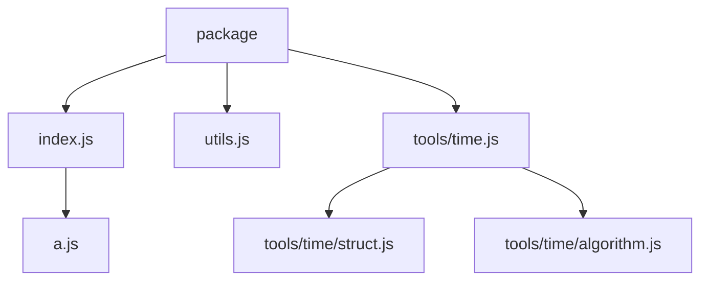

# ECMAScript Package Specification

[English](esp.md) | 简体中文

## 简介

本文为 ECMAScript 制定了一种 Package 的组织规范。

该规范提供一系列符合直觉的约定，皆在提高包结构的一致性与可维护性，且利于编写自动化工具。

## 引言

该规范在 [ECMAScript Module Specification](https://tc39.es/ecma262/#sec-modules)、[Node.js Package Specification](https://nodejs.org/api/packages.html) 和 [JSDoc Specification](https://jsdoc.app/) 的基础上进行制定。

但是该规范只保证与 ECMAScript Module Specification 和 Node.js Package Specification 的兼容性，
如果与 JSDoc Specification 中的描述有冲突，则以本规范为准。

## 概念

### 包结构

Package 由一个或多个 Module 组成。

一个典型的 Package 目录结构如下：

```
package/
├── src/
│   ├── index.js
│   ├── utils/
│   │   ├── math.js
│   │   └── pool.js
│   ├── utils.js
│   └── config.js
└── package.json
```

### 根目录

Package 需要定义一个 Root Directory，默认为 `src` 目录。

### 索引模块

索引模块有两种定义方式，且每个目录只允许存在最多一个索引模块：

- `index` 索引模块：`<dirname>/index.js` 对应该模块所在目录，推荐根目录使用。
- 同级同名索引模块：`<dirname>.js` 对应同级 `<dirname>/` 目录，推荐其它情况使用。

例如：

- `src/index.js` 是 `src` 目录的索引模块。
- `src/utils.js` 是 `src/utils/` 目录的索引模块。

## 包可访问性

在文档注释中使用标记声明模块/符号的包可访问性。

包可访问性标记分为三种：

- `@public` - 公开，可被任何包访问。
- `@internal` - 私有，不可被其它包访问，仅在自身包内可访问。
- `@unspecified` - 未指定，不能直接访问，但可通过其它公开的模块访问。

标记规则：

- 不存在任何包可访问性标记时，模块会被视为 `@unspecified`，符号会被视为 `@public`。
- `@unspecified` 标记不允许显式声明，应通过保持无标记的方式来表示。
- 符号不允许显式声明 `@public` 标记，应通过保持无标记的方式来表示。
- 模块的包可访问性只取决于其自身的标记。
- 符号的最终包可访问性取决于其所在的模块、父级符号、符号本身的可访问性（受限于最严格的层级）。

例如：

`src/utils.js`

```js
export const value = 1;

/**
 * @internal
 */
export const internalValue = 2;
```

`src/index.js`

```js
/**
 * This is a useful module.
 *
 * @public
 * @module
 */

export { value } from "./utils.js";
```

- `index.js` 模块被公开，任何包都可以访问。
- `utils.js` 模块未指定可访问性，未直接公开，但可以通过 `index.js` 这个公开模块访问。
- `value` 符号未指定可访问性，视为公开，其所在模块虽然未指定可访问性，但可通过公开的父模块 `index.js` 访问。
- `internalValue` 符号被标记为私有，即使是通过公开的模块 `index.js` 也无法访问。

注意：

- 注意不要混淆 "包可访问性" 与导出语句 `export`，使用 `export` 不意味着其它包就可以访问。
- 当模块的包可访问性为公开时，也意味着 `package.json` 会存在相应的入口声明。

例如，含有上面两个模块的包的 `package.json` 应该是：

```json
{
  "name": "my-package",
  "type": "module",
  "exports": {
    ".": "./src/index.js"
  }
}
```

## 包访问路径

默认情况下，以公开模块中根目录下不带文件扩展名的相对路径作为访问路径，如果该模块是索引模块，则使用其对应的目录名称。

例如：

- `src/index.js` -> `my-package`
- `src/tools/math.js` -> `my-package/tools/math`
- `src/utils.js` -> `my-package/utils`

可通过 `@module <module-path>` 自定义访问路径。

例如：

`src/tools/math.js`

```js
/**
 * This is a useful module.
 *
 * @public
 * @module math
 */
```

生成的 `exports` 声明为：

```json
{
  "exports": {
    "./math": "./src/tools/math.js"
  }
}
```

## 包组织约定

假设包结构如下：

```
package/
├── src/
│   ├── tools/
│   │   ├── math/
│   │   │   ├── vec2.js
│   │   │   └── vec3.js
│   │   ├── math.js
│   │   ├── time/
│   │   │   ├── struct.js
│   │   │   └── algorithm.js
│   │   └── time.js           - `@public`
│   ├── tools.js              - `@internal`
│   ├── others/
│   │   ├── b.js
│   │   └── c.js
│   ├── utils.js              - `@public`
│   ├── a.js
│   └── index.js              - `@public`
└── package.json
```

索引模块应导出对应目录下所有未指定包可访问性的模块。

最终模块导出关系如下：



生成的 `exports` 声明为：

```json
{
  "exports": {
    ".": "./src/index.js",
    "./utils": "./src/utils.js",
    "./tools/time": "./src/tools/time.js"
  }
}
```

## 二进制入口

有些运行时允许你将模块声明为二进制入口，使其成为可执行命令。

在模块级别注释中使用 `@bin [<command-name>]` 标记声明模块作为二进制入口。

标记值作为可执行入口名称，视运行时决定该值是必填、可选、还是禁止指定值。

且单个模块可以同时存在多个不同标记值的 `@bin` 标记。

例如：

`bin.js`

```js
/**
 * This is a bin entrypoint.
 *
 * @bin
 */
```

对应 `Node.js` 运行时：

`package.json`

```json
{
  "bin": "./bin.js"
}
```

`Node.js` 默认可执行入口名称是包名，那么以下模块：

`bin.js`

```js
/**
 * This is a bin entrypoint.
 *
 * @bin
 * @bin build
 */
```

对应：

`package.json`

```json
{
  "name": "cli",
  "bin": {
    "cli": "./bin.js",
    "build": "./bin.js"
  }
}
```

## 工具实现

该规范应由 Linter + Build Tool 共同实现。

Linter 负责：

- 检查当前包是否符合规范每一条要求。

例如如果 `src/index.js` 导出了 `@internal` 值：

```js
/**
 * This is a useful module.
 *
 * @public
 * @module
 */

export * from "./utils.js";
```

则会在导出语句处报错。

Build Tool 负责：

- 自动根据规范生成 `package.json` 中的 `exports` 和 `bin` 字段。

- 其它包可以通过 `my-package` 包访问 `value` 符号，但无法访问 `internalValue` 符号。
- 为了保证正确的包可访问性，可能会存在类似 `src/entrypoint/index.js` 的入口模块。
- 以上内容均可由构建工具自动生成，路径和文件名并非规范要求，可自行决定。
